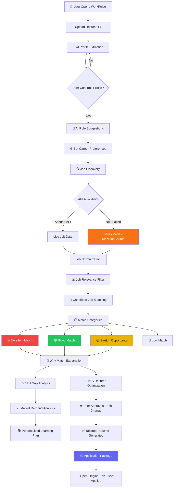
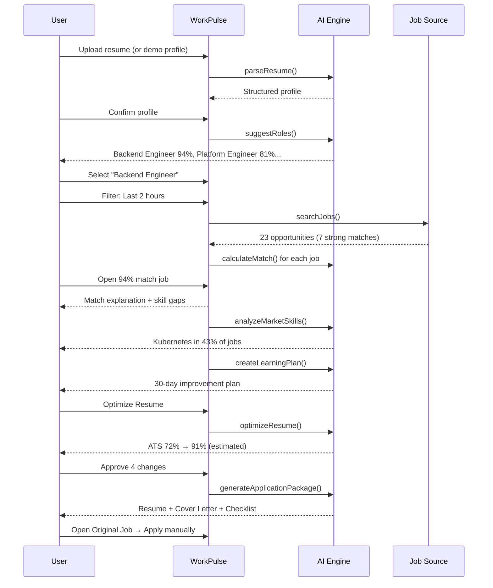
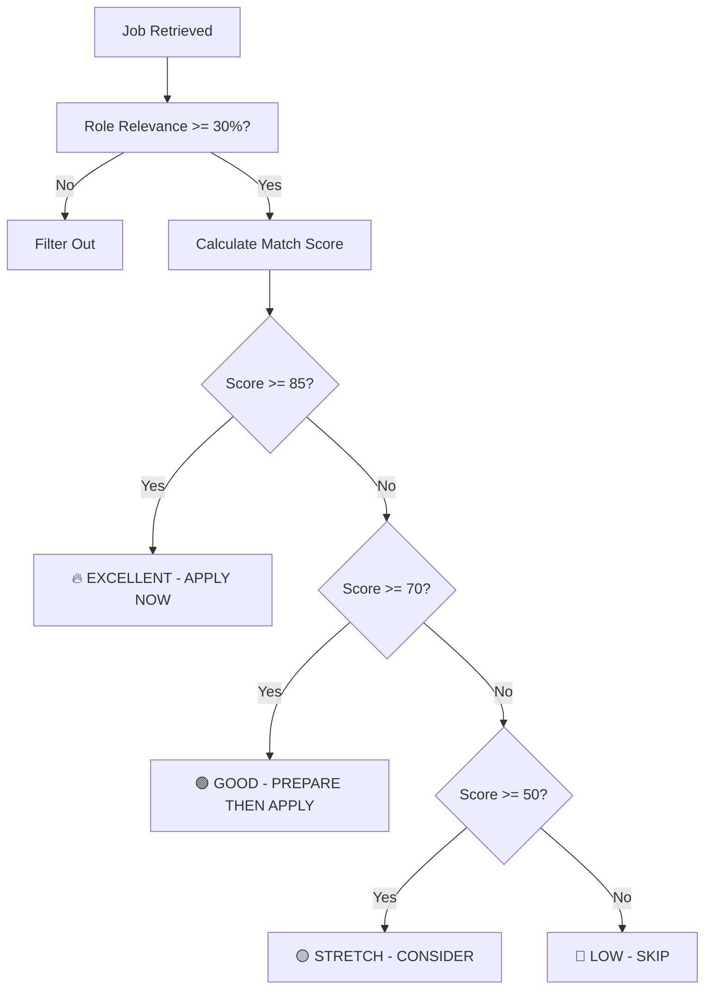

# WorkPulse — Application Flow

> **Tagline:** Don't just find jobs. Know which ones are worth applying to.

## End-to-End User Flow



## Demo Flow (3-Minute Walkthrough)



## Architecture Overview

```mermaid
flowchart LR
    subgraph Frontend["Next.js Frontend"]
        UI[Dashboard / Jobs / Profile / Skills / Resume]
        LS[(localStorage)]
    end

    subgraph API["API Routes"]
        R1[/api/resume/parse]
        R2[/api/jobs/search]
        R3[/api/market/analyze]
        R4[/api/resume/optimize]
    end

    subgraph AI["AI Modules"]
        A1[parseResume]
        A2[suggestRoles]
        A3[calculateMatch]
        A4[analyzeMarketSkills]
        A5[optimizeResume]
    end

    subgraph Jobs["Job Sources"]
        ADZ[AdzunaJobSource]
        MOCK[MockJobSource]
    end

    UI --> LS
    UI --> API
    API --> AI
    API --> Jobs
    ADZ -.->|fallback| MOCK
```

## Match Decision Logic



## Data Storage

| Data | Storage | Notes |
|------|---------|-------|
| Profile, preferences | localStorage | Client-side, no DB required |
| Jobs, matches | Session state | Refreshed on search |
| Saved jobs, applications | localStorage | Persists across sessions |
| Demo jobs | Seeded in code | 23 realistic IT jobs |

> **Note:** No external database is required for the MVP. Optional Supabase/Postgres can be added later for multi-device sync.

## Responsible AI Checkpoints

1. **Profile extraction** → User must confirm before use
2. **Resume changes** → Each change requires individual approval
3. **Missing skills** → Never added as fake experience
4. **ATS scores** → Clearly labeled as AI estimates
5. **Demo mode** → Clearly labeled "DEMO DATA" in UI
6. **Applications** → User opens original job; no auto-submission
