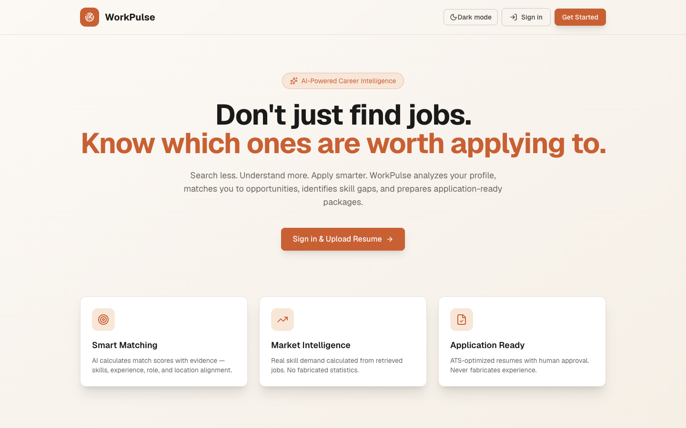
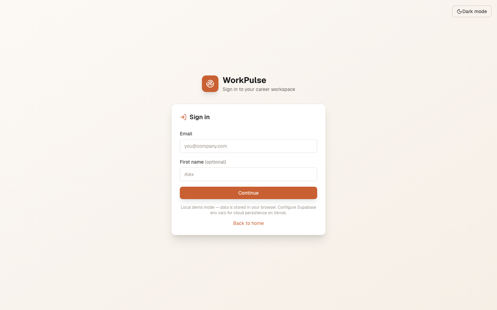
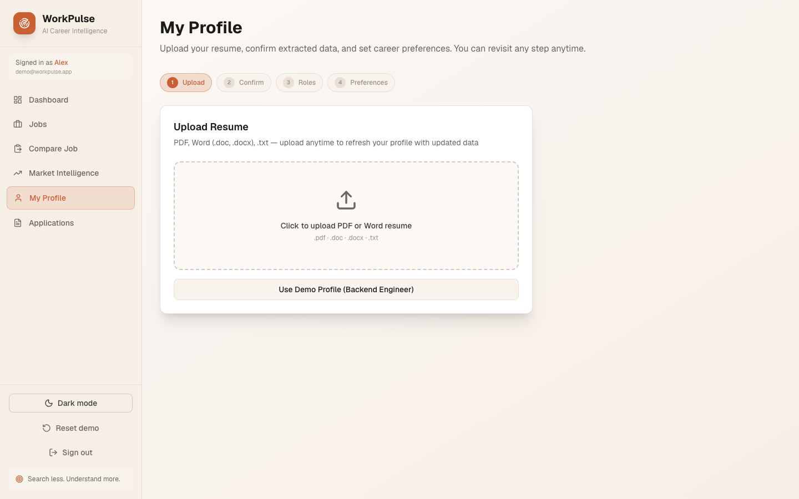
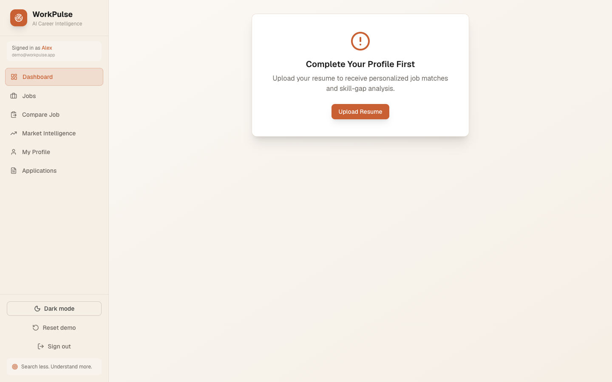
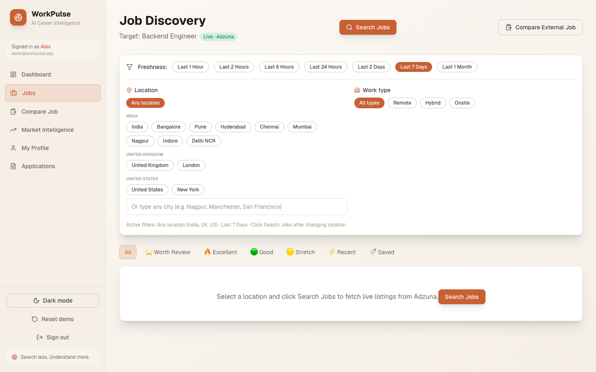
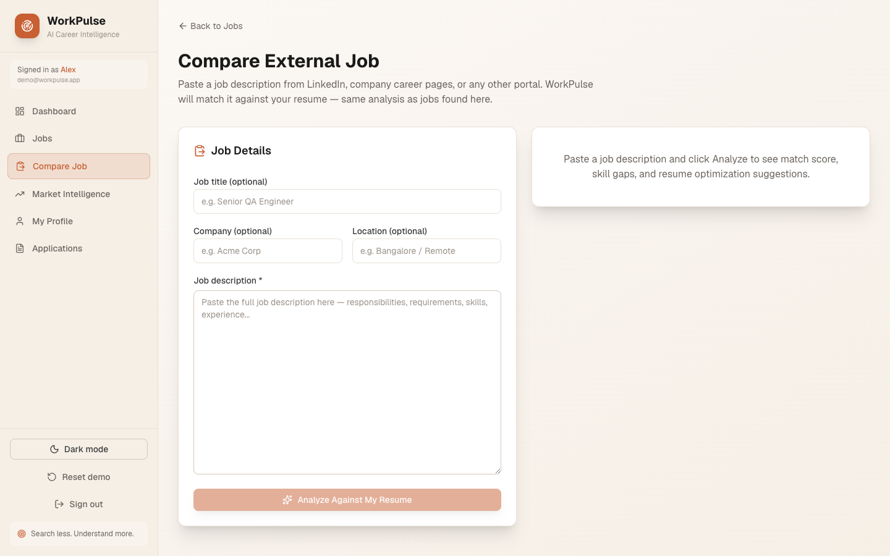
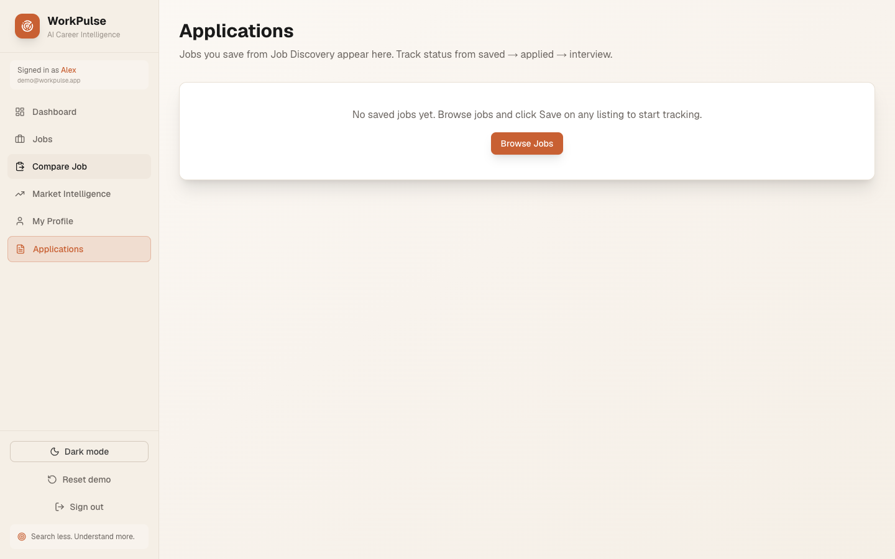
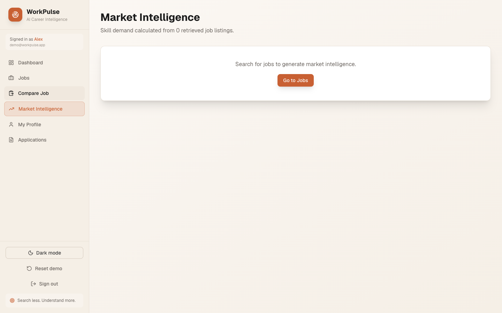

# WorkPulse

**Don't just find jobs. Know which ones are worth applying to.**

Search less. Understand more. Apply smarter.

| | |
|---|---|
| **Live Demo** | [https://workpulse-delta-eight.vercel.app](https://workpulse-delta-eight.vercel.app) |
| **Stack** | Next.js 16 · TypeScript · Tailwind CSS · OpenAI · Adzuna |
| **Persistence** | Browser localStorage (no database required for hackathon demo) |

---

## Problem Statement

Job seekers face thousands of listings every day, but traditional job boards offer **volume without insight**. Candidates cannot easily answer:

- Which jobs actually match their skills and experience?
- *Why* they match or don't match a specific role?
- What skills they're missing and how in-demand those skills are?
- Which applications are worth prioritizing?
- How to tailor a resume truthfully for a specific job?

Existing tools either show generic match percentages, push auto-apply bots, or give resume advice disconnected from the candidate's real profile. The result: wasted applications, missed opportunities, and no clear learning path.

---

## Solution

**WorkPulse** is an AI-powered personal career intelligence platform that turns job search from scrolling into decision-making.

| Step | What WorkPulse Does |
|------|---------------------|
| 1. **Profile** | Upload a resume (PDF, Word, or text) → AI extracts a structured professional profile |
| 2. **Discovery** | Search live IT jobs (Adzuna) or use 23 built-in demo jobs with freshness filters |
| 3. **Matching** | Evidence-based match scores with categories: Excellent, Good, Stretch, Low |
| 4. **Explain** | "Why match?" breakdown — skills, experience, role, location |
| 5. **Skill gaps** | Per-job gap analysis with market demand from real retrieved listings |
| 6. **Learning** | 30-day personalized roadmap based on your gaps |
| 7. **Resume** | ATS optimization with **human approval** for every change (never fabricates experience) |
| 8. **Applications** | Save jobs, track status (Saved → Applied → Interview → Rejected), prep materials |

### What makes WorkPulse different

| Job Boards | WorkPulse |
|------------|-----------|
| Show all jobs | Show jobs worth *your* time |
| Generic filters | AI match with explanations |
| No skill analysis | Skill gaps + market demand |
| One-size resume | Job-specific ATS optimization |
| Auto-apply bots | Human-in-the-loop, user-controlled |

### Key features

- AI profile extraction for any IT role
- Live job search via Adzuna (with demo fallback)
- Match engine with transparent score breakdown
- Market skill intelligence from actual job listings
- Save jobs and track applications in one place
- Light / dark theme
- Works fully offline in demo mode (no API keys required)

---

## Tech Stack

| Layer | Technology |
|-------|------------|
| **Framework** | [Next.js 16](https://nextjs.org/) (App Router) |
| **Language** | TypeScript |
| **UI** | Tailwind CSS v4, Lucide icons |
| **Validation** | Zod |
| **AI** | OpenAI API (optional — rule-based fallbacks when unset) |
| **Jobs API** | Adzuna (optional — mock source fallback) |
| **Resume parsing** | pdf-parse, mammoth, word-extractor |
| **Persistence** | Browser localStorage (hackathon default) |
| **Cloud auth/sync** | Supabase (optional) |
| **Testing** | Vitest |
| **Deployment** | Vercel |

### AI modules

| Module | Purpose |
|--------|---------|
| `parseResume()` | Extract structured profile from resume |
| `suggestRoles()` | Recommend suitable IT career roles |
| `calculateMatch()` | Evidence-based job matching |
| `analyzeSkillGap()` | Per-job skill gap analysis |
| `analyzeMarketSkills()` | Demand from retrieved listings |
| `createLearningPlan()` | 30-day personalized roadmap |
| `optimizeResume()` | ATS keyword optimization |
| `generateCoverLetter()` | Application package generation |

All AI outputs are validated with Zod schemas.

---

## How to Run

### Prerequisites

- Node.js 18+
- npm

### 1. Clone and install

```bash
cd hackathon/workpulse
npm install
```

### 2. Environment variables (optional)

```bash
cp .env.example .env.local
```

| Variable | Required | Description |
|----------|----------|-------------|
| `OPENAI_API_KEY` | No | Enables full AI features (fallbacks work without it) |
| `OPENAI_MODEL` | No | Default: `gpt-4o-mini` |
| `ADZUNA_APP_ID` | No | Live job search ([Adzuna developer portal](https://developer.adzuna.com/)) |
| `ADZUNA_APP_KEY` | No | Adzuna API key |
| `ADZUNA_COUNTRY` | No | e.g. `in`, `us`, `gb` |
| `NEXT_PUBLIC_SUPABASE_URL` | No | Enables cloud auth + sync |
| `NEXT_PUBLIC_SUPABASE_ANON_KEY` | No | Supabase anon key |

> **Hackathon demo:** The app runs fully without any env vars using demo jobs and rule-based logic.

### 3. Start development server

```bash
npm run dev
```

Open [http://localhost:3000](http://localhost:3000)

### 4. Other commands

```bash
npm run build      # Production build
npm run start      # Run production server
npm run test       # Run Vitest tests
npm run lint       # ESLint
npm run typecheck  # TypeScript check
```

### 5. Deploy to Vercel

```bash
npx vercel deploy --prod
```

Set `ADZUNA_APP_ID`, `ADZUNA_APP_KEY`, and `ADZUNA_COUNTRY` in the Vercel project dashboard for live jobs.

---

## Demo

### Live application

**https://workpulse-delta-eight.vercel.app**

Alternate URL: https://workpulse-sakshi-khandelwal.vercel.app

### Quick start (3-minute walkthrough)

1. Open the live demo → click **Sign in & Upload Resume**
2. Enter any email (e.g. `judge@demo.com`) → **Continue**
3. On **Profile**, click **Use Demo Profile (Backend Engineer)** → confirm
4. Go to **Jobs** → click **Search Jobs**
5. Open a high-match job (e.g. 85%+) → review match explanation and skill gaps
6. Click **Save** on a job → open **Applications** to track it
7. Click **Optimize Resume** → approve suggested changes
8. Visit **Skills** for market demand chart and learning roadmap

### Authentication note

- **Demo mode (current Vercel deploy):** Email + optional first name only. No password. Data stored in your browser.
- **Supabase mode:** Password field appears automatically when Supabase env vars are configured. Passwords are stored by Supabase Auth — not in this app's database.

---

## Screenshots

Screenshots captured from the live production deployment. See [docs/SCREENSHOTS.md](./docs/SCREENSHOTS.md) for descriptions and regeneration instructions.

### Landing page



### Sign in (demo mode)



### Profile & resume upload



### Dashboard



### Job discovery



### Job detail & save



### Applications tracker



### Skills & market intelligence



---

## Project structure

```
hackathon/workpulse/
├── docs/
│   ├── screenshots/       # README screenshots
│   └── SCREENSHOTS.md     # Screenshot guide
├── scripts/
│   └── capture-screenshots.mjs
├── src/
│   ├── app/               # Pages & API routes
│   ├── components/        # UI, layout, providers
│   ├── lib/               # AI, jobs, matching, persistence
│   └── types/             # TypeScript types
├── FLOW.md                # Mermaid architecture diagrams
└── .env.example
```

See [FLOW.md](./FLOW.md) for end-to-end user flow and architecture diagrams.

---

## Architecture highlights

- **Job source abstraction** — `AdzunaJobSource` with automatic fallback to `MockJobSource` (23 demo jobs)
- **Match engine** — Weighted scoring: skills (35%), role (25%), experience (20%), location (10%), mandatory skills (10%)
- **Human-in-the-loop** — User confirms profile, approves every resume change, applies manually on company sites
- **CRISP persistence** — Centralized localStorage service with schema versioning and demo reset

---

## Limitations (hackathon scope)

- Profile and saved jobs stored in browser localStorage — no cross-device sync unless Supabase is configured
- No LinkedIn/Indeed scraping (by design)
- No automatic job application submission
- ATS scores are estimates, not exact ATS engine results
- Job freshness depends on Adzuna provider data

---

## Responsible AI

- Never fabricates candidate experience
- Never fabricates salary or job URLs
- User confirms profile before matching
- User approves every resume modification
- Demo mode clearly labeled in UI
- User controls all applications

---

## License

MIT License — Open source for hackathon and community use.

---

**Job boards tell you what jobs exist. WorkPulse tells you which jobs matter to YOU.**
